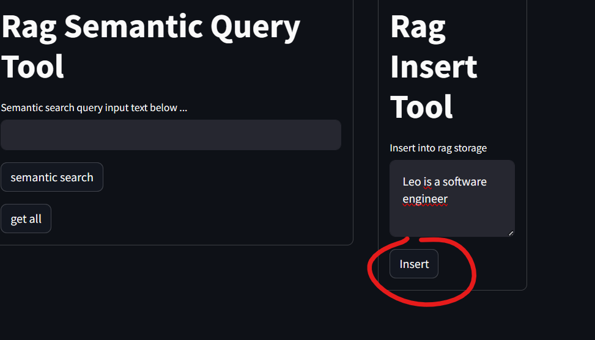

# GenAI Demos

## Set - Up
Install requirements
> pip install -r requirements.txt  
> cd project/frontend  
> streamlit run Hello.py

### External Resourced
- OpenAI key to run the agent  
If you don't have an OpenAI key you can set it up & running using Ollama mistral, just set the env _**llm_impl=ollama_mistral**_

### Environment Variables
I have provided files **dot_env_template**. Those files are just placeholder for a .env file that will contain your keys. Just:
> mv dot_env_template .env

### Vector Store (RAG storage)
There is a docker-compose that will set up a postgres in local, just:
> docker-compose -f docker-compose-pgvector up -d   

Note that this file contains the settings of your db parameters, if you want to change them edit the environment variables specified in 
this compose file

## What You can do?
> 1. RAG storage administration panel
>    2. insert in RAG storage
>    3. read all from RAG storage
>    4. semantic query 
> 5. Legacy LLM runner
>    6. ask something to an LLM (general purpose knowledge)
> 7. RAG LLM runner
>    8. ask something to an LLM (with RAG documents as context)
> 9. OpenAI Agent runner
>    10. run an agent demo and see the intermediate steps

## RAG storage admin panel
This is the RAG admin panel:

You can read all from your RAG storage:

You can insert into RAG storage:

You can run a semantic query:

## Legacy LLM runner
Here you run an LLM in legacy mode (without RAG, so he won't be aware of specific domain data)

Works, but if we ask him about me...

meh, general purpose I guess :/

## RAG LLM runner
Here you can run LLM in RAG mode. He selects a context before responding. The context is selected using a semantic search against the RAG storage:

## OpenAI Agent runner
Here you can run an agent that has access to a demo set of tools:

An agent is backed by an LLM (OpenAI in this case), and he is an entity that, given a question
decides what is the next step that can lead to the final answer;
for example we have:
- a tool that is able to sum 2 numbers
- a tool that is able to make a browser search
- a tool that is able to feed our RAG storage

If we ask him: "What is the age of Barak Obama? What is the age of his wife? Sum the two ages and remember the result"
An agent thinks:
...mmmm ok, I have to search on the browser for the age of Obama, then search for the age of his wife, call the tool I have to 
sum the two ages and call the tool I have to insert this information in "my knowledge" (my RAG)

Let's see:

we've got our answer! We can even see what are the intermediate steps he decided to do:

this means that he inserted this information in his knowledge as well, let's check by running a semantic query to the RAG storage:

# General architecture
